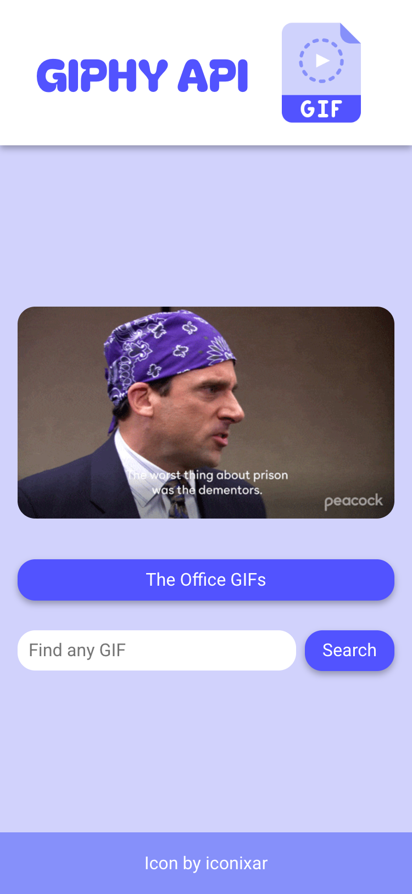

# GIPHY API

Fetch GIFs from the GIPHY API. You can click on the button to fetch GIFs from the best show ever (The Office, obviously). Alternatively, you can replace the GIF with anything you input in the search bar.

## Tech Stack

<!-- Badges from https://github.com/Ileriayo/markdown-badges -->

